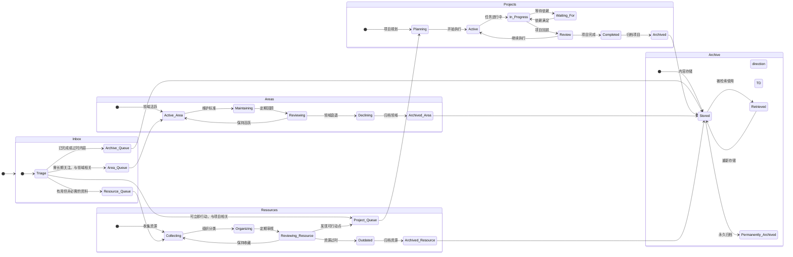
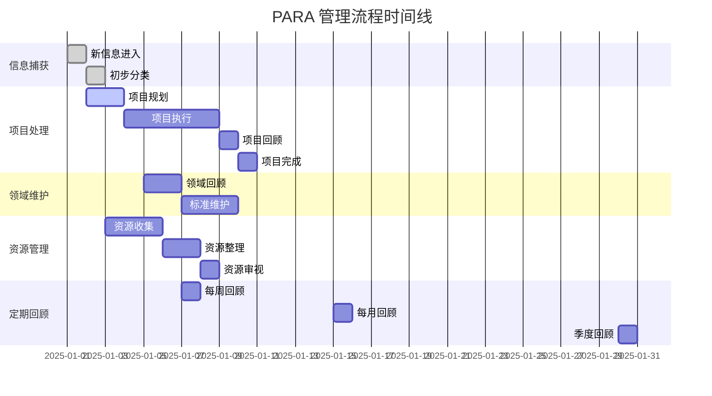
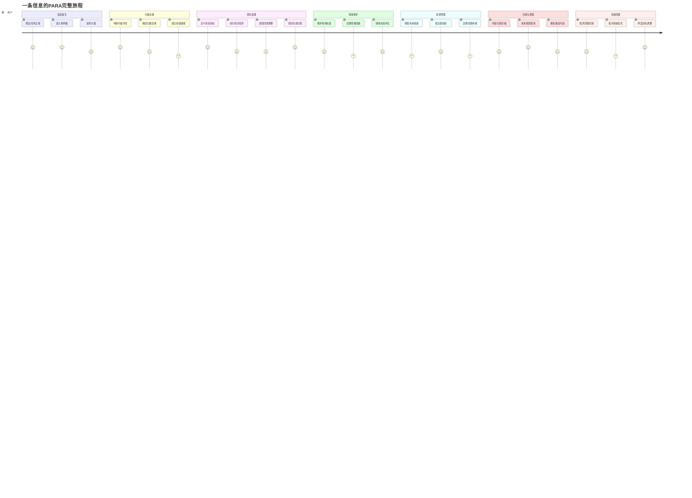

# PARA 管理流程详细工作流

## 1. 完整决策树流程图

```mermaid
flowchart TD
     第一层决策：是否可立即行动
    Inbox --> Actionable{这个信息<br/>是否可以立即行动?}
    
     项目相关分支
    ProjectCheck -->|是| Project[🎯 Projects<br/>项目区]
    ProjectCheck -->|否| AreaFromProject[🏠 Areas<br/>领域区]
    
     项目处理流程
    Project --> ProjectSetup[📋 定义项目目标<br/>和截止日期]
    ProjectSetup --> ProjectExecute[⚡ 执行项目任务]
    ProjectExecute --> ProjectComplete{项目<br/>是否完成?}
    ProjectComplete -->|是| Archive[🗄️ Archive<br/>归档区]
    ProjectComplete -->|否| ProjectExecute
    
     资源处理流程
    Resource --> ResourceOrganize[📂 按主题组织<br/>资源资料]
    ResourceOrganize --> ResourceReview[🔍 定期审视<br/>资源价值]
    ResourceReview --> ResourceUseful{资源是否<br/>仍然有用?}
    ResourceUseful -->|是| ResourceOrganize
    ResourceUseful -->|否| Archive
    
     定期回顾流程
    subgraph "📅 定期回顾系统"
        WeeklyReview[📅 每周回顾] --> WeeklyProject[检查项目进展]
        WeeklyReview --> WeeklyInbox[清理收件箱]
        
        MonthlyReview[📅 每月回顾] --> MonthlyArea[评估领域状态]
        MonthlyReview --> MonthlyResource[清理资源]
        
        QuarterlyReview[📅 每季度回顾] --> QuarterlyArchive[整理归档]
        QuarterlyReview --> QuarterlyGoal[调整目标]
    end
    
     样式定义
    classDef inboxStyle fill:#e1f5fe,stroke:#01579b,stroke-width:2px
    classDef projectStyle fill:#f3e5f5,stroke:#4a148c,stroke-width:2px
    classDef areaStyle fill:#fff3e0,stroke:#e65100,stroke-width:2px
    classDef resourceStyle fill:#e8f5e8,stroke:#1b5e20,stroke-width:2px
    classDef archiveStyle fill:#fafafa,stroke:#424242,stroke-width:2px
    classDef reviewStyle fill:#fff8e1,stroke:#f57f17,stroke-width:2px
    
    class Inbox inboxStyle
    class Project,ProjectSetup,ProjectExecute,ProjectComplete projectStyle
    class Area,AreaFromProject,AreaMaintain,AreaReview,AreaActive areaStyle
    class Resource,ResourceOrganize,ResourceReview,ResourceUseful resourceStyle
    class Archive,ArchiveStore,ArchiveRetrieve archiveStyle
    class WeeklyReview,MonthlyReview,QuarterlyReview reviewStyle
```

## 2. 状态转换图



## 3. 时间线视图



## 4. 用户旅程图



## 5. 详细工作流程说明

### 5.1 信息捕获阶段
- **Inbox（收件箱）**：所有新信息的统一入口
- **原则**：先收集，后分类，降低决策成本
- **工具**：快速笔记、语音记录、剪藏工具

### 5.2 分类决策阶段
- **可操作性判断**：信息是否可以立即行动？
- **项目相关性**：是否与具体项目相关？
- **领域相关性**：是否与负责领域相关？
- **资源价值**：是否对未来有用？

### 5.3 项目处理流程
- **目标定义**：明确项目目标和截止日期
- **任务执行**：分解任务，逐步推进
- **进度跟踪**：定期检查项目进展
- **项目完成**：达到目标后归档

### 5.4 领域维护流程
- **标准维护**：持续维护领域相关标准
- **定期回顾**：评估领域状态和进展
- **目标调整**：根据回顾结果调整目标

### 5.5 资源管理流程
- **资源收集**：收集可能有用的资料
- **主题组织**：按主题分类组织资源
- **价值审视**：定期评估资源价值

### 5.6 归档管理流程
- **内容存储**：将完成或过时内容归档
- **检索机制**：建立有效的检索系统
- **重新激活**：需要时重新激活归档内容

### 5.7 定期回顾系统
- **每周回顾**：检查项目进展，清理收件箱
- **每月回顾**：评估领域状态，清理资源
- **季度回顾**：整理归档，调整目标

## 6. 最佳实践建议

### 6.1 信息处理原则
- **流动性**：信息在PARA各区域间自由流动
- **可操作性**：优先处理可立即行动的信息
- **价值导向**：根据信息价值进行分类

### 6.2 项目管理要点
- **目标明确**：每个项目都有清晰的目标和截止日期
- **任务分解**：将大项目分解为可执行的小任务
- **进度跟踪**：定期检查项目进展

### 6.3 领域维护策略
- **持续投资**：在重要领域持续投入时间和精力
- **标准维护**：建立和维护领域相关标准
- **定期评估**：定期评估领域状态和进展

### 6.4 资源管理技巧
- **主题分类**：按主题对资源进行分类
- **价值评估**：定期评估资源的价值和相关性
- **及时清理**：及时清理过时或无用的资源

### 6.5 归档管理策略
- **系统存储**：建立系统的归档存储结构
- **检索便利**：确保归档内容易于检索
- **重新激活**：建立重新激活归档内容的机制

这个详细的PARA管理流程图表涵盖了从信息捕获到归档的完整生命周期，包括决策树、状态转换、时间线和用户旅程等多个维度，为PARA系统的实施提供了全面的指导。
