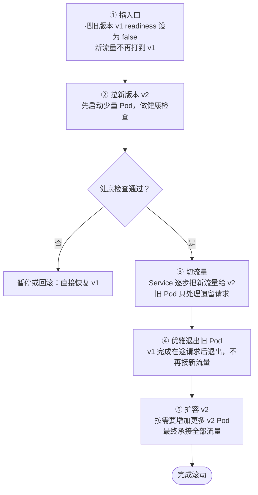
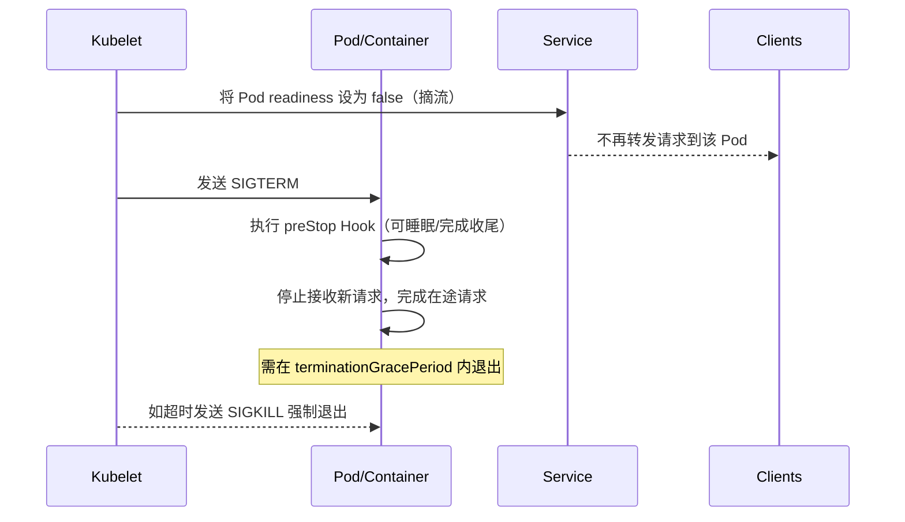

## 滚动升级 & 回滚机制

- Deployment 控制器先创建新 ReplicaSet，再“加新 Pod、减旧 Pod”，由 `maxSurge`/`maxUnavailable` 控制并行度。
- Service 通过就绪探针选择可用 Pod，未就绪的新 Pod 不接流量；旧 Pod 缩容前仍保持 Ready。
- 失败时可 `kubectl rollout undo deployment/<name>` 回滚到上一个 revision（旧 ReplicaSet 仍在，只是被缩容到 0）。
- 支持 `rollout pause/resume`，便于人工验证或观察指标后再继续。

## Pod 优雅退出：感知 kill 信号

实现要点：

- 在应用内捕获 SIGTERM，关闭接入、等待在途请求完成，再退出进程。
- 配置 `preStop` Hook（如短暂 sleep 或调用下线接口）和 `terminationGracePeriodSeconds`，确保有足够时间优雅收尾。
- `readinessProbe` 失败后会立即摘流，避免在退出过程中继续接新请求。
